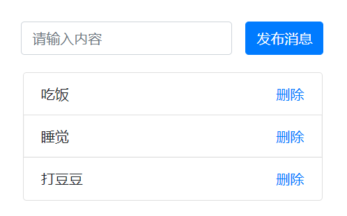

## 效果参考

## 功能需求

- 点击添加按钮，请求（/add）接口添加一条数据
- 点击删除按钮，请求（/delete）接口删除当前数据
- 双击文字，可以实现编辑功能（/edit接口）
- 刷新页面时，通过接口（/list）获取数据列表

## 运用知识点

- jQuery AJAX 请求后端接口（10分）
- 通过 Express 托管静态页面（10分）
- 通过 Express 编写 /add 接口（20分）
- 通过 Express 编写 /delete 接口（20分）
- 通过 Express 编写 /edit 接口（20分）
- 通过 Express 编写 /list 接口（20分）

==注意：可以不用数据库==