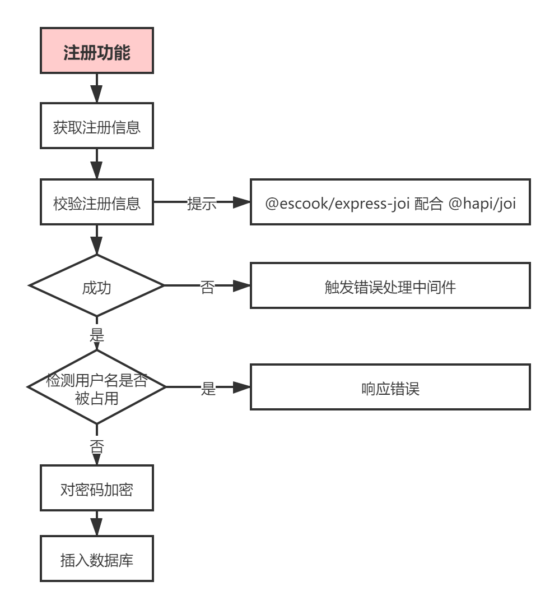
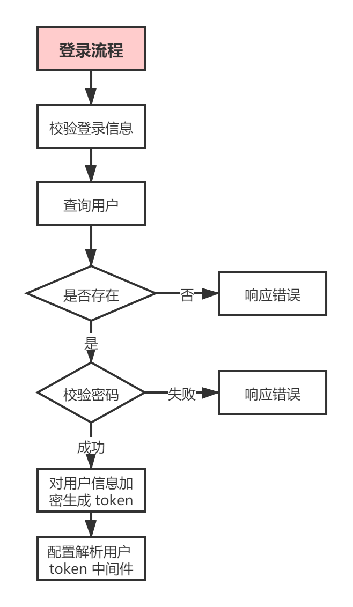
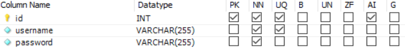

## 功能需求

- 实现完整的用户注册(`/api/reguser`)、登录(`/api/login`)流程（ev_users表）

- 实现留言的增加操作: `/user/add`<small>（ev_msg表）</small>

- 实现留言的删除操作: `/user/del`<small>（ev_msg表）</small>

- 实现留言的修改操作: `/user/edit`<small>（ev_msg表）</small>

- 实现留言的查找操作: `/user/find`<small>（ev_msg表）</small>

- ==以上增删改查都要有 token 校验（即登录后才能操作），可通过 Postman 自行测试通过！==

## 信息提示

### 注册/登录流程参考

### 用户表

### 信息表

## 运用知识点

- 注册（信息校验，连接 MySQL，JWT）30 分
- 登录（登录流程，解析 token，密码比对）30 分
- 新增信息（INSERT 语句）10 分
- 删除信息（DELETE 语句）10 分
- 修改信息（UPDATE 语句）10 分
- 查找信息（SELECT 语句）10 分