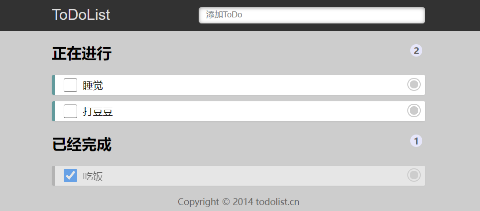

## 基本界面如下

## 接口使用说明

基准路径：http://localhost:3000/api

|  功能    | 请求方式  | 请求地址| 传递参数 |
|  ---     | ----  | ----| ---- |
| 增加     | POST | /add| `{ title: String, completed: Boolean  }` |
| 删除     | GET | /del| `/del?id=66`|
| 修改     | POST | /modify| `{ id: String, completed: Boolean }` |
| 列表     | GET | /list | `无`|

## 功能需求

- 顶部 Input 框中回车添加数据
- 点击数据项右侧按钮可以删除数据
- 点击数据项左侧的 checkbox 切换数据状态
- ==数据的操作依赖真实接口，基于 Redux 进行数据管理！==

## 考察知识点

- 能使用 Redux，明白 reducer、store、action 的使用方式，完成基本功能需求，40 分

- 使用 Redux 时异步如何处理（例如对数据的操作都是通过接口进行的，是异步的，可以使用 redux-thunk、redux-saga 等）40 分

- React 中组件的拆分、使用，20 分