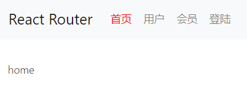

## 效果演示

[实际预览效果](./dist/index.html)，或者见 dist 目录中 index.html

## 界面参考

## 需求描述

1. 实现【首页】、【用户】、【会员】、【登录】的一级路由
2. 【会员】路由只有点击登录按钮之后才能访问（可以自己模拟实现），退出后则不能访问
3. 点击【用户】时会展示对应【添加用户】和【用户列表】的二级路由，添加用户回车后会跳转到用户列表
4. 用户列表有返回功能，可以返回到添加用户

## 考察知识点

- 考察 React 路由的综合应用

- 实现【首页】、【用户】、【会员】、【登录】（30分）

- 实现【会员】路由保护（25分）

- 实现添加用户和用户列表的路由逻辑（25分）

- 用户列表的返回功能（10分）

- 模拟登录、退出（10分）
