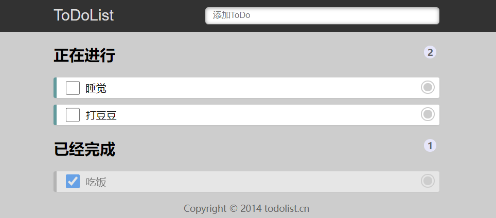

## 基本界面如下

## 功能需求

- 顶部 Input 框中回车添加数据
- 点击数据项右侧按钮可以删除数据
- 点击数据项左侧的 checkbox 切换数据状态
- 完成/未完成数据的统计
- ==数据可不必存储==

## 考察知识点

- 考察 Redux 的使用，明白 reducer、store、action 的使用方式，拆分组件，组件间传值等

- 回车添加数据功能（25分）
- 点击数据项右侧按钮可以删除数据（25分）
- 点击数据项左侧的 checkbox 切换数据状态（25分）
- 完成/未完成数据的统计（25分）